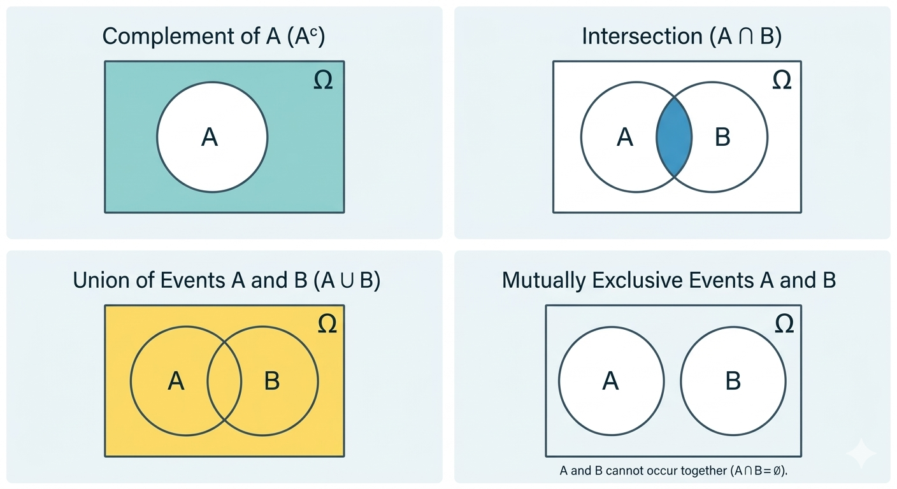
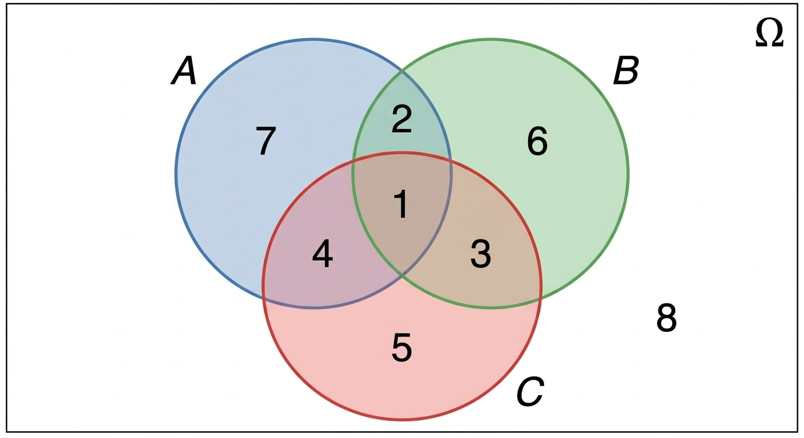

```{r}
library(pacman)

p_load(here)
```

\newcommand\norm[1]{\left\lVert#1\right\rVert}

## Proceso de analítica


```{r, out.width= '100%'}
knitr::include_graphics(here::here("images/Ciclo.png"))
```
[Wickham, H. y otros (2023)](https://r4ds.hadley.nz/)


# TEORÍA BÁSICA DE PROBABILIDAD {background-color="#0077b6"}

## Experimento aleatorio

::: columns

::: {.column width="70%"}


Un proceso es un **experimento aleatorio** si:

- Puede repetirse bajo las mismas condiciones.
- Tiene varios resultados posibles.
- No es posible predecir con certeza el resultado antes de realizarlo.
- Permite identificar el conjunto de todos los resultados posibles (espacio muestral).

*Ejemplo: lanzamiento de un dado*

:::

::: {.column width="30%"}


:::

:::

## Espacio Muestral

### Definición

</br>

El **espacio muestral**, denotado por $\Omega$, es el conjunto de todos los resultados posibles de un experimento aleatorio. Los **elementos** son los posibles resultados $\omega$, de tal forma que:

$$
\Omega = \{\omega : \omega \text{ es un resultado posible del experimento}\}
$$

## Espacio Muestral

### Clasificación según el tipo de resultados

**1️⃣ Espacios muestrales discretos**

Conjunto de resultados finito o infinito numerable.

$$
\Omega = \{\omega_1, \omega_2, \omega_3, \dots \}
$$

**2️⃣ Espacios muestrales continuos**

Conjunto de resultados infinito no numerable, generalmente asociado a intervalos de números reales.

$$
\Omega \subseteq \mathbb{R}
$$

---

## Ejemplos

### 🎲 Experimento 1: Lanzar un dado

::: columns

::: {.column width="70%"}

</br></br>

$$
\Omega_1 = \{1,2,3,4,5,6\}
$$

Tipo: **Finito (discreto)**

:::

::: {.column width="30%"}


:::

:::


## Ejemplos

### 🚗 Experimento 2: Conteo de accidentes en carreteras en un periodo

$$
\Omega_2 = \{0,1,2,3,\dots\}
$$

Tipo: **Infinito numerable (discreto)**


::: {.fragment}
</br>

### 📏 Experimento 3: Medición de estaturas de personas

$$
\Omega_3 = \{x \in \mathbb{R} : x > 0\}
$$

Tipo: **Infinito no numerable (continuo)**

:::

## σ-álgebra y eventos

### Definición

<div style="text-align: justify;">

Sea $\Omega$ el espacio muestral de un experimento aleatorio. Una **σ-álgebra** (sigma-álgebra) sobre $\Omega$, denotada por $\mathcal{F}$, es una colección de subconjuntos de $\Omega$ que satisface:

1. $\Omega \in \mathcal{F}$
2. Si $A \in \mathcal{F}$, entonces su complemento $A^c \in \mathcal{F}$
3. Si $A_1, A_2, A_3, \dots \in \mathcal{F}$, entonces $\bigcup_{i=1}^{\infty} A_i \in \mathcal{F}$

Como consecuencia, también se cumple que:

$\bigcap_{i=1}^{\infty} A_i \in \mathcal{F}$

</div>

---

### Eventos

Los elementos de la σ-álgebra $\mathcal{F}$ se denominan **eventos**.

Así, un evento es un subconjunto del espacio muestral:

$$A \subseteq \Omega, \quad A \in \mathcal{F}$$

::: {.fragment}

### Ejemplo: Lanzamiento de un dado

$$\Omega = \{1,2,3,4,5,6\}$$

Evento: "obtener un número par" entonces $A = \{2,4,6\}$

Aquí, $A \in \mathcal{F}$ es un **evento**.

:::


## Probabilidad como frecuencia relativa

La **probabilidad** de un evento puede interpretarse como la frecuencia relativa de ocurrencia en un gran número de repeticiones del experimento.

Si un experimento se repite $n$ veces y el evento $A$ ocurre $n_A$ veces, entonces:

$$fr(A) = \frac{n_A}{n}$$

. . . 

En el caso clásico con resultados equiprobables, se define:

$$P(A) = \frac{\text{número de casos favorables}}{\text{número de casos posibles}}$$


## Conceptos Básicos de Conjuntos

### 1. Conjunto Complemento ($A^c$ o $A'$)

::: {.columns}
::: {.column width="60%"}
El complemento contiene todos los resultados en el espacio muestral $\Omega$ que **no** están en el evento $A$.

$$P(A^c) = 1 - P(A)$$

:::

::: {.column width="40%"}

```{r}
#| echo: false
#| fig-align: "center"
#| out-width: "100%"

```
:::
  
:::

*Ejemplo:* Si $A$ es el evento "el paciente presenta hipertensión", $A^c$ es el evento "el paciente **no** presenta hipertensión".

---

### 2. Intersección de Eventos ($A \cap B$)

::: {.columns}
::: {.column width="60%"}

La intersección representa la ocurrencia simultánea de dos eventos, $A$ y $B$. Matemáticamente, $A \cap B$.

$$P(A \text{ y } B) = P(A \cap B)$$
:::
::: {.column width="40%"}

```{r}
#| echo: false
#| fig-align: "center"
#| out-width: "100%"

```

:::
:::

*Ejemplo:* Si $A$ es "paciente con diabetes" y $B$ es "paciente con obesidad", $A \cap B$ son los pacientes que padecen ambas condiciones.

--- 

### 3. Eventos Mutuamente Excluyentes

::: {.columns}
::: {.column width="60%"}
Dos eventos son mutuamente excluyentes (o disjuntos) si no pueden ocurrir al mismo tiempo. Su intersección es vacía ($A \cap B = \emptyset$).

$$ P(A \cap B) = 0$$

:::
::: {.column width="40%"}

```{r}
#| echo: false
#| fig-align: "center"
#| out-width: "100%"

```

:::
:::

*Ejemplo:* Un test diagnóstico rápido cuyo resultado es "Positivo" o "Negativo". No puede ser ambos simultáneamente.

---

### 4. Unión de Eventos (A∪B)

::: {.columns}
::: {.column width="60%"}
La unión contiene todos los resultados que están en A, o en B, o en ambos. Se denota como $A \cup B$.

</br></br>

$$P(A \cup B)=P(A)+P(B)−P(A \cap B)$$
:::
::: {.column width="40%"}

```{r}
#| echo: false
#| fig-align: "center"
#| out-width: "100%"


```

:::
:::

*Ejemplo:* Pacientes que requieren derivación a "Servicio de Fisioterapia" (A) O a "Servicio de Traumatología" (B).


---

### Ejemplo

Se están analizando a 36 pacientes que ingresaron este mes a la unidad de cuidados intensivos, los cuales pueden presentar tres condiciones de salud, estos son pacientes con:

* Evento A: Artrosis severa (limitación mecánica).
* Evento B: Hipertensión arterial (riesgo cardiovascular).
* Evento C: Deterioro cognitivo leve (riesgo de caídas/desorientación).

---

Los pacientes se han clasificado de acuerdo con las condiciones que presentan:

::: {.center}
{width=75%}
:::

Encuentre: $A \cap B$, $B \cap C$, $A \cup C$, $B^c \cap A$, $A \cap B \cap C$, $B^c \cap A$, $(A \cup B) \cap C^c$

---

## Espacio de Probabilidad

Un **espacio de probabilidad** es la tripleta: $(\Omega, \mathcal{F}, P)$

donde:

- $\Omega$: espacio muestral  
- $\mathcal{F}$: σ-álgebra de eventos  
- $P$: medida de probabilidad  

--- 

### Axiomas de la medida de probabilidad

La función $P : \mathcal{F} \to [0,1]$ satisface:

* $P(A) \ge 0 \quad \forall A \in \mathcal{F}$
* $P(\Omega) = 1$
* Si $A_1, A_2, A_3, \dots \in  \mathcal{F}$ son eventos mutuamente excluyentes:

$$P\left(\bigcup_{i=1}^{\infty} A_i\right) = \sum_{i=1}^{\infty} P(A_i)$$
Por tanto,

$$0 \le P(A) \le 1$$


## Propiedades de un espacio de probabilidad

Sea $(\Omega, \mathcal{F}, P)$ un espacio de probabilidad y $A, B \in \mathcal{F}$.


* $P(\varnothing) = 0$
* $P(A^c) = 1 - P(A)$
* Si $A \subseteq B$, entonces: $P(A) \le P(B)$
* $P(A \cup B) = P(A) + P(B) - P(A \cap B)$

. . . 

Si $A \cap B = \varnothing$ (mutuamente excluyentes):

$$P(A \cup B) = P(A) + P(B)$$


---

## Ejemplos

### 🧪 Ejemplo 1: Resultado de una prueba diagnóstica

Sea:

- $A$: paciente tiene la enfermedad  
- $B$: prueba positiva  

Probabilidad de interés: $P(B)$

Proporción de pacientes con resultado positivo.

---

### 💊 Ejemplo 2: Respuesta a tratamiento

Si en un ensayo clínico:

- 80 de 100 pacientes mejoran

$$P(\text{mejoría}) = \frac{80}{100} = 0.8$$

---

### ❤️ Ejemplo 3: Factores de riesgo

Sea:

- $A$: paciente fuma  
- $B$: paciente tiene enfermedad cardiovascular  

Probabilidad conjunta: $P(A \cap B)$

</br>

Pacientes que **fuman y tienen enfermedad**.

---

### 🏥 Ejemplo 4: Regla del complemento

</br>

Si la probabilidad de complicación quirúrgica es: $P(C) = 0.1$

</br></br>

Entonces la probabilidad de que **no se tengan complicaciones** es: $$P(C^c) = 1 - P(C) = 0.9$$

# REGLAS DE CONTEO {background-color="#0077b6"}

## Teorema fundamental del conteo

Si un experimento se puede realizar en $k$ etapas, y cada una se puede hacer de $n_i$ formas diferentes, enonces el experimento completo se puede realizar de 

$$n_1 \times n_2 \times \cdots \times n_k$$

formas distintas. Esto se conoce como **regla de la multiplicación**.

---

### Ejemplo

Un fisioterapeuta puede elegir:

- 3 tipos de **terapia**
- 2 tipos de **vendaje**
- 4 ejercicios de **rehabilitación**

¿Cuántos planes de tratamiento diferentes puede diseñar?

::: {.fragment}

$$ 3 \times 2 \times 4 = 24 $$

Hay **24 posibles combinaciones de tratamiento**.

:::

---

### Regla de la multiplicación

Se usa cuando:

- un proceso ocurre **paso a paso**
- en cada paso hay **varias opciones**
- queremos contar **todas las combinaciones posibles**


Ejemplo: Debe asignar

- 5 enfermeros a turno mañana
- 4 enfermeros a turno tarde

¿De formas de elegir los enfermeros para coordinar ambos turnos?

::: {.fragment}
$5 \times 4 = 20$
:::

---

## Permutaciones

Se usan cuando **el orden importa**

Ejemplos donde el orden importa:

- orden de atención de pacientes
- orden de llegada en una carrera
- orden de presentación de casos clínicos

---

### Fórmula de permutaciones

Número de formas de ordenar **n objetos**:

$$n!$$

donde

$$n! = n \times (n-1) \times (n-2) \times \cdots \times 1$$
Ejemplo: En una clínica hay **4 pacientes** esperando fisioterapia. ¿De cuántas formas distintas pueden ser atendidos?

::: {.fragment}

$$4! = 4 \times 3 \times 2 \times 1 = 24$$

Hay **24 formas diferentes de realizar la atención**.

:::

---

### Combinatorias

Se usan cuando **el orden NO importa**

Ejemplos:

- elegir pacientes para un estudio clínico
- seleccionar medicamentos para un protocolo
- elegir miembros de un equipo médico

::: {.fragment}
El número de formas de elegir **k elementos de n**:

$${n \choose k} = \frac{n!}{k!(n-k)!}$$

:::

---

### Ejemplo

De **8 enfermeros** se deben seleccionar **3** para un comité de calidad. ¿Cuántos comités diferentes son posibles?

</br></br>

::: {.fragment}

$${8 \choose 3} = \frac{8!}{3!5!} = 56$$

Hay **56 posibles grupos**.

:::

## ¿Cómo saber cuál usar?

| Situación | Método |
|-----------|--------|
| Proceso en varias etapas | Regla de multiplicación |
| Importa el orden | Permutaciones |
| No importa el orden | Combinatorias |

Ejemplos:

- Orden de atención → **Permutación**
- Selección de pacientes → **Combinatoria**
- Elección de terapia + ejercicio → **Multiplicación**

---

### Ejercicios

1. Un plan de rehabilitación incluye: 4 tipos de terapia, 3 ejercicios y 2 tipos de vendaje. ¿Cuántos planes diferentes pueden diseñarse?


2. En una sala hay **5 pacientes** esperando atención. ¿De cuántas formas distintas pueden ser atendidos?


3. De **10 enfermeros**, se deben elegir **4** para un equipo de investigación. ¿Cuántos equipos diferentes pueden formarse?

4. En fisioterapia hay **6 ejercicios** disponibles. ¿De cuántas maneras se pueden elegir **2 ejercicios** para una sesión?

5. Tres pacientes deben realizar pruebas en **3 equipos diferentes**. ¿De cuántas maneras pueden asignarse?

# PROBABILIDAD CONDICIONAL {background-color="#0077b6"}