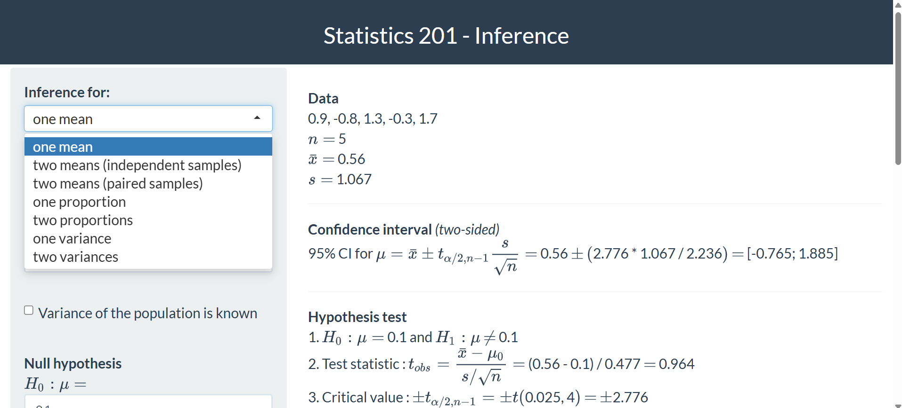
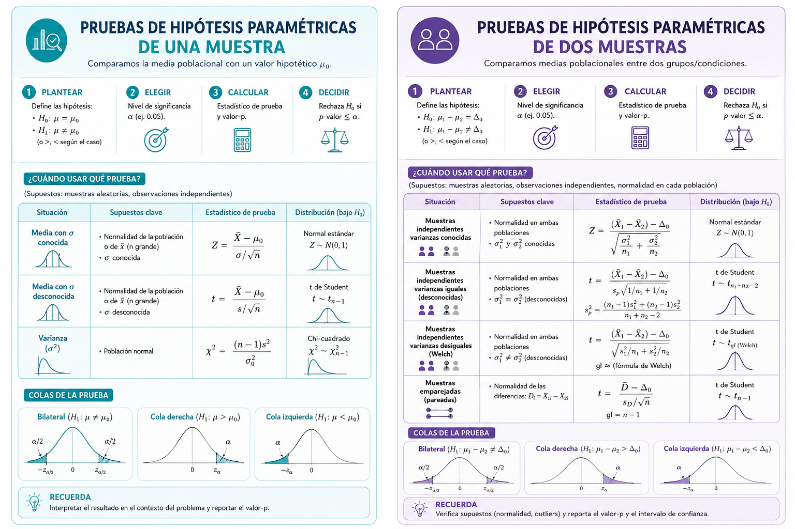
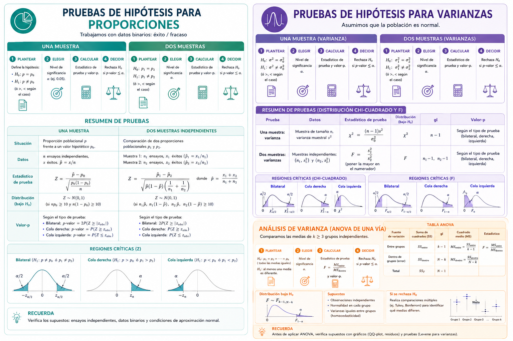
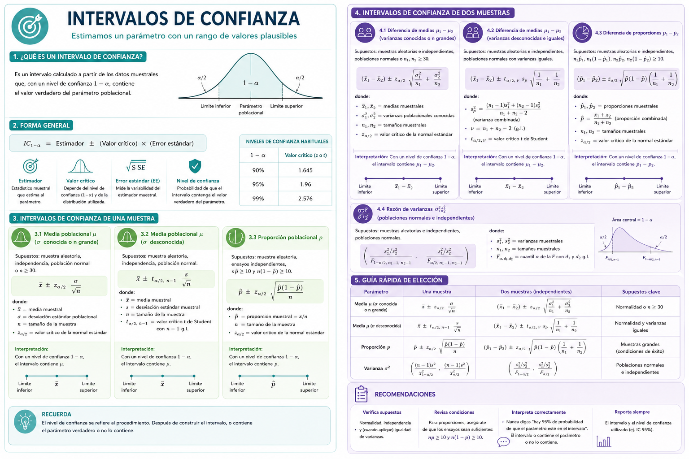

```{r}
library(pacman)
p_load(here, ggplot2, dplyr, tidyr)
```

\newcommand\norm[1]{\left\lVert#1\right\rVert}

# INFERENCIA ESTADÍSTICA {background-color="#0077b6"}

## ¿Qué es la inferencia estadística? {style="font-size: 90%;"}


La **inferencia estadística** es el proceso de obtener conclusiones sobre una **población** a partir de una **muestra**.

::: {.fragment}

Dos grandes problemas:

1. **Estimación**: ¿cuánto vale el parámetro?
   - Estimación puntual: $\bar{x}$, $\hat{p}$, $s^2_x$
   - Estimación por intervalo: IC al 90%, 95%, 99%

2. **Contraste de hipótesis**: ¿es compatible el parámetro con un valor particular?
   - ¿La media de HbA1c^[hemoglobina glicosilada o glicada, es un análisis de sangre que indica el nivel promedio de glucosa (azúcar) en tu cuerpo durante los últimos 2 a 3 meses] de los pacientes es distinta de 7%?
   - ¿El tratamiento A es mejor que el B?
:::

## El ciclo inferencial en salud {style="font-size: 90%;"}

### Distribución muestral

Si tomamos **todas** las muestras posibles de tamaño $n$ y calculamos el estadístico $T$ en cada una, obtenemos la **distribución muestral** de $T$.

::: {.fragment}

**Teorema Central del Límite (TCL):**

Si $X_1, X_2, \ldots, X_n \overset{iid}{\sim} (\mu, \sigma^2)$ y $n$ es suficientemente grande:

$$\bar{X} \sim N\!\left(\mu,\; \frac{\sigma^2}{n}\right)$$

El **error estándar** es $SE = \sigma/\sqrt{n}$.

:::


# DISTRIBUCIONES MUESTRALES {background-color="#0077b6"}

## Suma de variables aleatorias normales {style="font-size: 90%;"}

::: columns

::: {.column width="50%"}

Si $X_1, \ldots, X_n \overset{iid}{\sim} N(\mu, \sigma^2)$:

$$\sum_{i=1}^n X_i \sim N(n\mu,\; n\sigma^2)$$

$$\bar{X} = \frac{1}{n}\sum_{i=1}^n X_i \sim N\!\left(\mu,\; \frac{\sigma^2}{n}\right)$$

::: {.fragment}

La variable **estandarizada**:

$$Z = \frac{\bar{X} - \mu}{\sigma/\sqrt{n}} \sim N(0,1)$$

:::

:::

::: {.column width="50%"}

```{r}
#| fig-width: 5
#| fig-height: 4.5
set.seed(42)
x_seq <- seq(-4, 4, length.out=500)
df_tcl <- data.frame(
  x = rep(x_seq, 4),
  y = c(dnorm(x_seq, 0, 1),
        dnorm(x_seq, 0, 1/sqrt(5)),
        dnorm(x_seq, 0, 1/sqrt(20)),
        dnorm(x_seq, 0, 1/sqrt(50))),
  n = rep(c("σ (n=1)", "σ/√5", "σ/√20", "σ/√50"), each=500)
)
df_tcl$n <- factor(df_tcl$n, levels=c("σ (n=1)","σ/√5","σ/√20","σ/√50"))
ggplot(df_tcl, aes(x, y, color=n)) +
  geom_line(linewidth=1.2) +
  scale_color_manual(values=c("#adb5bd","#4895ef","#4361ee","#3a0ca3")) +
  labs(x="Z", y="Densidad", color="Error\nestándar",
       title="La variabilidad de X̄ disminuye con n") +
  theme_minimal(base_size=13) +
  theme(legend.position="right")
```

:::

:::

## El estimador: propiedades deseables {style="font-size: 85%;"}


Un **estimador** $\hat{\theta}$ de un parámetro $\theta$ es una función de los datos muestrales que busca aproximarse al valor verdadero.

**Propiedades:**

| Propiedad | Significado |
|-----------|-------------|
| **Insesgado** | $E[\hat\theta] = \theta$ |
| **Consistente** | $\hat\theta \xrightarrow{p} \theta$ cuando $n \to \infty$ |
| **Eficiente** | Varianza mínima |


::: {.callout-tip}
**En salud:**
- $\bar{X}$ es estimador insesgado de $\mu$ (HbA1c promedio)
- $\hat{p} = X/n$ es estimador insesgado de $p$ (proporción de hipertensos)
- $S^2$ con divisor $n-1$ es insesgado para $\sigma^2$
:::

::: {.fragment}

::: {.callout-note}
La calidad de un estimador mejora al **aumentar el tamaño de muestra**. El error estándar $SE = s/\sqrt{n}$ cuantifica la precisión.
:::
:::

## Distribución Chi-cuadrado ($\chi^2$)

```{r}
#| fig-width: 9.5
#| fig-height: 6
x_ch <- seq(0.01, 30, length.out=500)
df_ch <- data.frame(
  x = rep(x_ch, 4),
  y = c(dchisq(x_ch, 1), dchisq(x_ch, 3),
        dchisq(x_ch, 8), dchisq(x_ch, 15)),
  gl = rep(c("k = 1","k = 3","k = 8","k = 15"), each=500)
)
ggplot(df_ch, aes(x, y, color=gl)) +
  geom_line(linewidth=1.3) +
  scale_color_manual(values=c("#e63946","#f77f00","#2dc653","#0077b6")) +
  coord_cartesian(ylim=c(0, 0.5)) +
  labs(x=expression(chi^2), y="Densidad", color="gl",
       title=expression("Distribución " * chi^2)) +
  theme_bw(base_size=13) +
  theme(legend.position = "bottom")
```

## Distribución Chi-cuadrado ($\chi^2$) {style="font-size: 90%;"}

Si $Z_1, \ldots, Z_k \overset{iid}{\sim} N(0,1)$:

$$X^2_k = Z_1^2 + Z_2^2 + \cdots + Z_k^2$$

$$X^2_k \sim \chi^2_{(k)}$$

**Usos:**

>  Prueba de bondad de ajuste
>
>  Prueba de independencia (tablas)
>
> Inferencia sobre **varianzas**

Solo toma valores mayores que cero; se vuelve más simétrica cuando crece $k$.


## Distribución t de Student

```{r}
#| fig-width: 8.5
#| fig-height: 6
x_t <- seq(-5, 5, length.out=500)
df_t <- data.frame(
  x = rep(x_t, 5),
  y = c(dt(x_t, 1), dt(x_t, 5), dt(x_t, 10), dt(x_t, 30), dnorm(x_t)),
  dist = rep(c("t(1)","t(5)","t(10)","t(30)","Normal"), each=500)
)
df_t$dist <- factor(df_t$dist, levels=c("t(1)","t(5)","t(10)","t(30)","Normal"))
ggplot(df_t, aes(x, y, color=dist, linetype=dist)) +
  geom_line(linewidth=1.2) +
  scale_color_manual(values=c("#e63946","#f77f00","#2dc653","#0077b6","#212121")) +
  scale_linetype_manual(values=c("solid","solid","solid","solid","dashed")) +
  labs(x="t", y="Densidad", color="Distribución", linetype="Distribución",
       title="Distribución t de Student vs Normal") +
  theme_bw(base_size=13) +
  theme(legend.position = "bottom")
```


## Distribución t de Student {style="font-size: 90%;"}

Si $Z \sim N(0,1)$ y $V \sim \chi^2(k)$ independientes:

$$T = \frac{Z}{\sqrt{V/k}} \sim t_{(k)}$$

En la práctica:

$$T = \frac{\bar{X} - \mu}{S/\sqrt{n}} \sim t_{(n-1)}$$

**Usos:** Inferencia sobre medias cuando $\sigma$ es **desconocida**.

- Más dispersa que $N(0,1)$
- Con $k \to \infty$ converge a $N(0,1)$


## Distribución F de Fisher-Snedecor


```{r}
#| fig-width: 8.5
#| fig-height: 6
x_f <- seq(0.01, 8, length.out=500)
df_f <- data.frame(
  x = rep(x_f, 4),
  y = c(df(x_f,2,5), df(x_f,5,10), df(x_f,10,20), df(x_f,20,50)),
  param = rep(c("F(2,5)","F(5,10)","F(10,20)","F(20,50)"), each=500)
)
ggplot(df_f, aes(x, y, color=param)) +
  geom_line(linewidth=1.3) +
  coord_cartesian(ylim=c(0,1.5)) +
  scale_color_manual(values=c("#e63946","#f77f00","#2dc653","#0077b6")) +
  labs(x="F", y="Densidad", color="Parámetros",
       title="Distribución F de Fisher-Snedecor") +
  theme_bw(base_size=13) +
  theme(legend.position = "bottom")
```

## Distribución F de Fisher-Snedecor {style="font-size: 90%;"}


Si $U \sim \chi^2(k_1)$ y $V \sim \chi^2(k_2)$ independientes:

$$F = \frac{U/k_1}{V/k_2} \sim F^{k_1}_{k_2}$$

En la práctica:

$$F = \frac{S_1^2}{S_2^2}\sim F^{n_1-1}_{n_2-1} \quad \text{(bajo } H_0: \sigma_1^2=\sigma_2^2\text{)}$$

**Usos:**

- Comparar **varianzas** (dos muestras)
- **ANOVA** (comparar varias medias)

Solo toma valores mayores que cero; asimétrica positiva.

# CONTRASTE DE HIPÓTESIS {background-color="#0077b6"}

## Pruebas de hipótesis

{fig-align="center"}

## Estructura general del contraste {style="font-size: 88%;"}


Un **contraste de hipótesis** es una regla de decisión estadística que permite, a partir de los datos muestrales, tomar una decisión sobre una afirmación sobre un parámetro poblacional.

**Pasos:**

1. Plantear $H_0$ y $H_a$
2. Elegir el nivel de significancia $\alpha$
3. Identificar el estadístico de prueba
4. Calcular el estadístico y el **valor-p**
5. Tomar la decisión: rechazar o no rechazar $H_0$
6. Interpretar en contexto clínico

---

## Estructura general del contraste {style="font-size: 88%;"}

::: {.callout-note}
**Hipótesis nula** $H_0$: afirmación de partida que supone igualdad, ausencia de efecto o valor de referencia.

**Hipótesis alterna** $H_a$: lo que quiere demostrarse; contiene $\neq$, $>$ o $<$.
:::

</br> 


::: {.fragment}

| Prueba | $H_a$ | Región de rechazo |
|--------|-------|-------------------|
| Bilateral | $\theta \neq \theta_0$ | Dos colas |
| Unilateral $>$ | $\theta > \theta_0$ | Cola derecha |
| Unilateral $<$ | $\theta < \theta_0$ | Cola izquierda |

:::

## Tipos de error {style="font-size: 90%;"}


<div style="font-size:0.85em;">

| | **$H_0$ es verdadera** | **$H_0$ es falsa** |
|---|---|---|
| **Rechazar $H_0$** | Error tipo I ($\alpha$) | Decisión correcta ($1-\beta$) |
| **No rechazar $H_0$** | Decisión correcta ($1-\alpha$) | Error tipo II ($\beta$) |

</div>

</br> 

- **$\alpha$** = P(rechazar $H_0$ | $H_0$ verdadera) = **nivel de significancia**
- **$\beta$** = P(no rechazar $H_0$ | $H_0$ falsa)
- **Potencia** = $1 - \beta$ = P(detectar el efecto cuando existe)


::: {.callout-warning}
**En salud:**
- Error tipo I: declarar efectivo un tratamiento ineficaz → daño al paciente
- Error tipo II: no detectar un tratamiento efectivo → oportunidad perdida
- Los dos errores están en conflicto: reducir $\alpha$ tiende a aumentar $\beta$
:::


## Relación entre $\alpha$, $\beta$ y potencia

```{r}
#| fig-width: 11
#| fig-height: 6

library(ggplot2)
library(dplyr)

# Parámetros
mu0   <- 0
mu1   <- 1
sigma <- 1.8
n     <- 25

se <- sigma / sqrt(n)

# Nivel de confianza 95%
alpha   <- 0.05
conf    <- 1 - alpha
z_alpha <- qnorm(1 - alpha/2)

# Región crítica bilateral
critico_izq <- mu0 - z_alpha * se
critico_der <- mu0 + z_alpha * se

# Secuencia
x_seq <- seq(mu0 - 4*se, mu1 + 4*se, length.out = 1200)

# Distribuciones

df <- data.frame( x = rep(x_seq, 2), y = c( dnorm(x_seq, mu0, se), dnorm(x_seq, mu1, se) ), hipotesis = rep( c("H0", "Ha"), each = length(x_seq) ) )


# α: error tipo I
df_alpha_der <- data.frame(
  x = seq(critico_der, max(x_seq), length.out = 300)
)

df_alpha_der$y <- dnorm(df_alpha_der$x, mu0, se)

df_alpha_izq <- data.frame(
  x = seq(min(x_seq), critico_izq, length.out = 300)
)

df_alpha_izq$y <- dnorm(df_alpha_izq$x, mu0, se)

# β: error tipo II
df_beta <- data.frame(
  x = seq(critico_izq, critico_der, length.out = 400)
)

df_beta$y <- dnorm(df_beta$x, mu1, se)

# Potencia = 1 - β
df_power_1 <- data.frame(
  x = seq(min(x_seq), critico_izq, length.out = 300)
)

df_power_1$y <- dnorm(df_power_1$x, mu1, se)

df_power_2 <- data.frame(
  x = seq(critico_der, max(x_seq), length.out = 300)
)

df_power_2$y <- dnorm(df_power_2$x, mu1, se)

# Gráfica
ggplot(df, aes(x, y, color = hipotesis)) +

  # Curvas
  geom_line(linewidth = 1.5) +

  # α
  geom_area(
    data = df_alpha_der,
    aes(x, y),
    fill = "#d62828",
    alpha = 0.45,
    inherit.aes = FALSE
  ) +

  geom_area(
    data = df_alpha_izq,
    aes(x, y),
    fill = "#d62828",
    alpha = 0.45,
    inherit.aes = FALSE
  ) +

  # β
  geom_area(
    data = df_beta,
    aes(x, y),
    fill = "#f4a261",
    alpha = 0.5,
    inherit.aes = FALSE
  ) +

  # Potencia
  geom_area(
    data = df_power_1,
    aes(x, y),
    fill = "#2a9d8f",
    alpha = 0.5,
    inherit.aes = FALSE
  ) +

  geom_area(
    data = df_power_2,
    aes(x, y),
    fill = "#2a9d8f",
    alpha = 0.5,
    inherit.aes = FALSE
  ) +

  # Valores críticos
  geom_vline(
    xintercept = c(critico_izq, critico_der),
    linetype = "dashed",
    color = "gray20",
    linewidth = 0.8
  ) +

  # Etiquetas
  annotate(
    "text",
    x = critico_der + 0.15,
    y = 1.30,
    label = "Valor crítico",
    size = 4
  ) +

  annotate(
    "text",
    x = critico_izq - 0.15,
    y = 1.30,
    label = "Valor crítico",
    size = 4
  ) +

annotate( "text", x = critico_der + 0.25, y = dnorm(critico_der, mu0, se)/2+0.1, label = expression(alpha/2), color = "#d62828", size = 7, fontface = "bold" ) + 
  annotate( "text", x = critico_izq - 0.25, y = dnorm(critico_izq, mu0, se)/2+0.1, label = expression(alpha/2), color = "#d62828", size = 7, fontface = "bold" ) +
annotate( "text", x = mu0 + 0.2, y = dnorm(mu0 + 0.2, mu1, se)*0.8+0.2, label = expression(beta), color = "#e76f51", size = 7, fontface = "bold" )  +
annotate( "text", x = mu1 + 0.9, y = dnorm(mu1 + 0.9, mu1, se)*0.65+0.3, label = "Potencia\n(1 - β)", color = "#2a9d8f", size = 5, fontface = "bold" ) +
  annotate("text",
    x = 0,  y = 1.55,
    label = "Nivel de confianza",
    size = 5,
    fontface = "bold"
  ) +
scale_color_manual(
  values = c(
    "H0" = "#1d3557",
    "Ha" = "#6a4c93"
  ),
  labels = c(
    expression(H[0]:mu==mu[0]),
    expression(H[a]:mu==mu[1])
  )
) +

  labs(
    title = "Errores Tipo I y II, Potencia y Nivel de Confianza",
    subtitle = "Prueba bilateral para la media",
    x = "Estadístico de prueba",
    y = "Densidad",
    color = NULL
  ) +

  theme_minimal(base_size = 14) +

  theme(
    legend.position = "top",
    plot.title = element_text(
      face = "bold",
      size = 18
    ),
    plot.subtitle = element_text(
      size = 12,
      color = "gray35"
    ),
    panel.grid.minor = element_blank()
  )
```

## El valor-p {style="font-size: 90%;"}


El **valor-p** es la probabilidad de observar un estadístico de prueba **tan extremo o más extremo** que el calculado, **suponiendo que $H_0$ es verdadera**.


**Regla de decisión:**

- Si $p \leq \alpha$: rechazar $H_0$ → resultado estadísticamente significativo
- Si $p > \alpha$: no rechazar $H_0$ → no hay evidencia suficiente

::: {.callout-warning}
El valor-p **NO** es:

- La probabilidad de que $H_0$ sea cierta
- La magnitud del efecto clínico
- Una medida de importancia práctica

:::

---

## Significancia vs relevancia clínica {style="font-size: 88%;"}

::: {.callout-tip}
**Interpretación clínica:**

Un resultado puede ser **estadísticamente significativo** ($p < 0.05$) pero **clínicamente irrelevante** (efecto muy pequeño en muestra grande).

Siempre debe acompañar el valor-p con el **tamaño del efecto** y el **intervalo de confianza**.
:::


**Ejemplo**

Un estudio con 50,000 pacientes encontró que un medicamento redujo el peso corporal en promedio **0.4 kg** respecto al placebo ($p < 0.001$).

Aunque el resultado es altamente significativo estadísticamente, la reducción de 0.4 kg probablemente tiene poca importancia clínica para la mayoría de pacientes.


## Determinación del tamaño de muestra {style="font-size: 88%;"}

**Para contrastar una media:**

$$\boxed{n = \frac{(z_{\alpha/2} + z_\beta)^2 \,\sigma^2}{\delta^2}}$$

donde $\delta = |\mu_1 - \mu_0|$ es la diferencia clínicamente relevante.


</br> 

**Para contrastar una proporción:**

$$\boxed{n = \frac{(z_{\alpha/2} + z_\beta)^2 \,p_0(1-p_0)}{\delta^2}}$$

---

## Determinación del tamaño de muestra {style="font-size: 88%;"}

**Ejemplo:** Queremos detectar una reducción de 5 mmHg en PAS ($\delta=5$), $\sigma=15$, $\alpha=0.05$, potencia $=80\%$.

$$z_{0.025}=1.96, \quad z_{0.20}=0.842$$

$$n = \frac{(1.96+0.842)^2 \times 15^2}{5^2} = \frac{(2.802)^2 \times 225}{25} \approx 71$$
</br> 

::: {.fragment}

```{r}
#| echo: true
power.t.test(delta=5, sd=15, sig.level=0.05,
             power=0.80, type="one.sample")$n
```

:::


# PRUEBA $\chi^2$ DE INDEPENDENCIA {background-color="#0077b6"}

## Concepto y estadístico {style="font-size: 88%;"}

Evalúa si existe **asociación** entre dos variables categóricas en una tabla de contingencia $r \times c$.

$$\boxed{H_0: \text{Las variables son independientes} \quad vs \quad H_a: \text{existe asociación}}$$


**Frecuencias esperadas** bajo $H_0$:

$$E_{ij} = \frac{n_{i\cdot} \cdot n_{\cdot j}}{n}$$

**Estadístico de prueba:**

$$\chi^2 = \sum_{i}\sum_{j} \frac{(O_{ij} - E_{ij})^2}{E_{ij}} \sim \chi^2_{(r-1)(c-1)}$$

**Condición:** $E_{ij} \geq 5$ en todas las celdas.

---

## Observaciones

::: {.callout-tip}
Si alguna $E_{ij} < 5$, se recomienda:

- Prueba exacta de Fisher (tablas $2\times 2$)
- Combinar categorías cuando sea posible clínicamente

:::

::: {.callout-note}
La prueba $\chi^2$ **no mide la fuerza** de la asociación. Para ello use:

- $V$ de Cramér: $V = \sqrt{\chi^2 / (n \cdot \min(r-1,c-1))}$
- Razón de momios (OR) en tablas $2\times 2$
:::


## Ejemplo: Tabaquismo y EPOC {style="font-size: 80%;"}


**Contexto:** 300 pacientes atendidos en una clínica respiratoria. Se registró si el paciente es fumador y si tiene diagnóstico de EPOC.

| | EPOC (+) | EPOC (−) | Total |
|------|:---:|:---:|:---:|
| Fumador | 85 | 65 | 150 |
| No fumador | 35 | 115 | 150 |
| **Total** | 120 | 180 | 300 |

**¿Existe una asociación entre tener diagnóstico de EPOC y fumar?**

$E_{11} = \frac{150 \times 120}{300} = 60 \quad E_{12} = \frac{150 \times 180}{300} = 90 \quad E_{21} = 60 \quad E_{22} = 90$

$$\chi^2 = \frac{(85-60)^2}{60}+\frac{(65-90)^2}{90}+\frac{(35-60)^2}{60}+\frac{(115-90)^2}{90}$$

$$= 10.42 + 6.94 + 10.42 + 6.94 = \mathbf{34.72}$$


$gl = (2-1)(2-1) = 1; \quad \chi^2_{0.05,1} = 3.841$

Como $34.72 > 3.841$ **→ Se rechaza $H_0$**.

---

## Código R: Prueba chi-cuadrado {style="font-size: 80%;"}

```{r}
#| echo: true
tabla <- matrix(c(85, 65, 35, 115),
                nrow=2, byrow=TRUE,
                dimnames=list(c("Fumador","No fumador"),
                              c("EPOC+","EPOC-")))
chisq.test(tabla)
```

::: {.fragment}
La función `chisq.test()` en R aplica automáticamente la **corrección de continuidad de Yates** para tablas $2 \times 2$, esto busca evitar sobreestimar la evidencia estadística en muestras pequeñas.

$$\chi^2_Y = \sum_{i}\sum_{j} \frac{|O_{ij} - E_{ij}| - 0.5)^2}{E_{ij}}$$
:::

## Visualización: barras apiladas y agrupadas {style="font-size: 85%;"}

```{r}
#| fig-width: 10
#| fig-height: 4
df_chi2 <- data.frame(
  Tabaquismo = rep(c("Fumador","No fumador"), each=2),
  EPOC       = rep(c("EPOC+","EPOC−"), 2),
  n          = c(85, 65, 35, 115)
)
df_chi2 <- df_chi2 |>
  group_by(Tabaquismo) |>
  mutate(pct = n/sum(n)*100)

p1 <- ggplot(df_chi2, aes(x=Tabaquismo, y=pct, fill=EPOC)) +
  geom_col(position="dodge", color="white") +
  scale_fill_manual(values=c("#e63946","#adb5bd")) +
  labs(y="%", title="Prevalencia de EPOC por tabaquismo",
       fill=NULL) +
  theme_minimal(base_size=13)

p2 <- ggplot(df_chi2, aes(x=Tabaquismo, y=pct, fill=EPOC)) +
  geom_col(color="white") +
  scale_fill_manual(values=c("#e63946","#adb5bd")) +
  labs(y="%", title="Perfil fila",
       fill=NULL) +
  geom_text(aes(label=paste0(round(pct,1),"%")),
            position=position_stack(vjust=0.5), color="white", size=4.5) +
  theme_minimal(base_size=13)

library(patchwork)
p1 + p2
```

::: {.callout-tip}
El 56.7% de los fumadores tiene EPOC vs solo el 23.3% de los no fumadores. La razón de momios $OR = (85\times115)/(65\times35) = 4.3$ indica que los fumadores tienen 4.3 veces más probabilidad de tener EPOC.
:::

# PRUEBAS PARA PROPORCIONES {background-color="#0077b6"}

## Prueba para una proporción {style="font-size: 88%;"}

Contrasta si la proporción poblacional es igual a un valor $p_0$.

$$H_0: p = p_0 \quad vs \quad H_a: p \neq p_0$$

**Estadístico de prueba:**

$$\boxed{Z = \frac{\hat{p} - p_0}{\sqrt{p_0(1-p_0)/n}}}$$

Bajo $H_0$, $Z \sim N(0,1)$ aproximadamente (requiere $np_0 \geq 5$ y $n(1-p_0) \geq 5$).

**IC al $(1-\alpha)$%:**

$$\hat{p} \pm z_{\alpha/2}\sqrt{\frac{\hat{p}(1-\hat{p})}{n}}$$

---

## Prueba para una proporción {style="font-size: 88%;"}

**Ejemplo:** Una unidad de enfermería reporta 72% de adherencia a la higiene de manos ($p_0 = 0.72$). En una auditoría de 80 registros se observó adherencia en 64 casos ($\hat{p} = 0.80$). ¿Ha mejorado?

::: {.fragment}
$H_0: p = 0.72$ vs $H_a: p > 0.72$
:::

::: {.fragment}

$$Z = \frac{0.80 - 0.72}{\sqrt{0.72 \times 0.28/80}} = \frac{0.08}{0.0502} = 1.595$$

$p\text{-valor} = P(Z > 1.595) = 0.055$
:::

::: {.fragment}

**Conclusión:** Con $\alpha = 0.05$, $p = 0.055 > 0.05$. No se rechaza $H_0$; la evidencia no es suficiente para afirmar que la adherencia mejoró.

:::

## Código de R: prueba sobre una proporción {style="font-size: 88%;"}

```{r}
#| echo: true
# Prueba unilateral: ¿Ha mejorado la adherencia?
prop.test(x = 64, n = 80, p = 0.72,
          alternative = "greater",
          conf.level = 0.95, correct = FALSE)
```

::: {.fragment}

```{r}
#| fig-width: 9
#| fig-height: 3
z_obs <- (0.80 - 0.72) / sqrt(0.72*0.28/80)
x_z <- seq(-4, 4, length.out=500)
df_z1 <- data.frame(x=x_z, y=dnorm(x_z))
df_rej <- data.frame(x=seq(qnorm(0.95), 4, length.out=200))
df_rej$y <- dnorm(df_rej$x)

ggplot(df_z1, aes(x, y)) +
  geom_line(linewidth=1.3, color="#0077b6") +
  geom_area(data=df_rej, aes(x=x,y=y), fill="#e63946", alpha=0.6) +
  geom_vline(xintercept=z_obs, color="#f77f00", linewidth=1.4, linetype="dashed") +
  annotate("text", x=z_obs+0.2, y=0.15, label=paste0("Z=",round(z_obs,3)),
           color="#f77f00", size=5) +
  annotate("text", x=2.4, y=0.08, label="α=0.05", color="#e63946", size=5) +
  labs(x="Z", y="Densidad", title="Región de rechazo (prueba unilateral derecha)") +
  theme_minimal(base_size=13)
```

:::

## IC al 95% para una proporción {style="font-size: 85%;"}

Retomando el ejemplo de higiene de manos: $n = 80$, $x = 64$, $\hat{p} = 0.80$.

$$\boxed{IC_{1-\alpha}: \; \hat{p} \pm z_{\alpha/2}\sqrt{\frac{\hat{p}(1-\hat{p})}{n}}}$$

$$IC_{95\%} = 0.80 \pm 1.96\sqrt{\frac{0.80 \times 0.20}{80}} = 0.80 \pm 1.96 \times 0.0447 = 0.80 \pm 0.088$$

$$IC_{95\%}(p) = \mathbf{[0.712,\; 0.888]}$$

::: {.callout-tip}
**Interpretación:** Con 95% de confianza, la tasa real de adherencia se ubica entre **71.2% y 88.8%**. El valor de referencia $p_0 = 0.72$ queda dentro del IC, por lo que no existe evidencia suficiente de una tendencia hacia la mejora.
:::

---

## IC para una proporción usando R {style="font-size: 85%;"}


```{r}
#| echo: true
prop.test(x = 64, n = 80, conf.level = 0.95, correct = FALSE)$conf.int
```

`prop.test()` no utiliza el intervalo de Wald.

- `prop.test(correct = FALSE)` genera el intervalo con puntaje de Wilson
- `prop.test()` genera un intervalo con el puntaje de Wilson y con corrección de continuidad
- En la práctica suele preferirse el intervalo de **Wilson** porque tiene mejor cobertura que el intervalo de Wald.


## API de Shiny {style="font-size: 88%;"}


[Abrir API](https://antoinesoetewey.shinyapps.io/statistics-201/)

{fig-align="center"}


## Prueba para dos proporciones {style="font-size: 88%;"}


Compara proporciones de dos grupos independientes.

$$H_0: p_1 = p_2 \quad vs \quad H_a: p_1 \neq p_2$$

**Estadístico de prueba:**

$$\boxed{Z = \frac{\hat{p}_1 - \hat{p}_2}{\sqrt{\hat{p}(1-\hat{p})\left(\frac{1}{n_1}+\frac{1}{n_2}\right)}}}$$

donde $\hat{p} = \frac{x_1+x_2}{n_1+n_2}$ es la proporción combinada.

**IC al $(1-\alpha)$%:**


$$(\hat{p}_1-\hat{p}_2) \pm z_{\alpha/2}\sqrt{\frac{\hat{p}_1(1-\hat{p}_1)}{n_1}+\frac{\hat{p}_2(1-\hat{p}_2)}{n_2}}$$

---

## Prueba para dos proporciones {style="font-size: 88%;"}

**Ejemplo clínico:** Tasa de infección nosocomial en dos UCI.

| UCI | Pacientes ($n$) | Infecciones ($x$) | $\hat{p}$ |
|-----|:---:|:---:|:---:|
| A | 80 | 18 | 0.225 |
| B | 75 | 8 | 0.107 |

$\hat{p} = (18+8)/(80+75) = 0.168$

$$Z = \frac{0.225-0.107}{\sqrt{0.168 \times 0.832 \times (1/80+1/75)}} = 1.9637$$

$p\text{-valor} = 2 \times P(Z > 1.9637) = 0.049 < 0.05$

**→ Se rechaza $H_0$ al nivel de significancia del 5%.**


## Código R: dos proporciones {style="font-size: 85%;"}

```{r}
#| echo: true
prop.test(x = c(18, 8), n = c(80, 75),
          alternative = "two.sided",
          conf.level = 0.95, correct = FALSE)
```

::: {.callout-tip}
> $Z^2 = 1.964^2 \approx 3.8$
>
> El valor p es 0.049 < 0.05.
:::

## IC al 95% para la diferencia de proporciones {style="font-size: 82%;"}

En el ejemplo de infecciones en UCI: $n_1=80$, $\hat{p}_1=0.225$; $n_2=75$, $\hat{p}_2=0.107$.


$$SE = \sqrt{\frac{0.225\times0.775}{80}+\frac{0.107\times0.893}{75}} = \sqrt{0.00218+0.00127} = 0.0588$$

$$IC_{95\%}(p_1-p_2) = 0.118 \pm 1.96\times0.0588 = \mathbf{[0.003,\;0.233]}$$

```{r}
#| echo: true
prop.test(c(18, 8), c(80, 75), correct = FALSE)$conf.int
```

::: {.callout-tip}
**Interpretación:** Con 95% de confianza, la tasa de infección de la UCI A supera a la de la UCI B entre **0.3 y 23 puntos porcentuales**. El intervalo no contiene el 0, confirmando la diferencia significativa entre unidades.
:::

# PRUEBAS PARA MEDIAS {background-color="#0077b6"}

## Prueba t para una media {style="font-size: 88%;"}


Contrasta si la media poblacional es igual a un valor $\mu_0$.

$$H_0: \mu = \mu_0 \quad vs \quad H_a: \mu \neq \mu_0$$

**Estadístico de prueba:**

$$\boxed{t = \frac{\bar{x} - \mu_0}{s/\sqrt{n}}} \sim t_{n-1} \text{ bajo } H_0$$

Supuesto: la variable sigue distribución normal (o $n \geq 30$).

**IC al $(1-\alpha)$%:**

$$\bar{x} \pm t_{\alpha/2, n-1} \cdot \frac{s}{\sqrt{n}}$$

---

## Prueba t para una media {style="font-size: 88%;"}

**Ejemplo:** El umbral de buen control glucémico en diabetes tipo 2 es $HbA1c = 7\%$. En 20 pacientes de un programa de rehabilitación se midió: $\bar{x} = 7.95\%$, $s = 0.712\%$.

$H_0: \mu = 7$ vs $H_a: \mu \neq 7$

$$t = \frac{7.95 - 7}{0.712/\sqrt{20}} = \frac{0.95}{0.159} = 5.97$$

$gl = 19$; $t_{0.025, 19} = 2.093$

Como $|t| = 5.97 > 2.093$ **→ Rechazar $H_0$**.

$p = 0 < 0.05$. El nivel medio de HbA1c es significativamente mayor que 7%.


## Código R: prueba t una muestra

```{r}
#| echo: true
HbA1c <- c(7.2,8.1,7.5,8.8,7.0,9.1,6.8,8.3,7.9,7.4,
           8.6,7.1,8.9,7.7,8.2,9.0,7.3,8.0,7.6,8.5)

xb <- mean(HbA1c); s <- sd(HbA1c); n <- length(HbA1c)
t.test(HbA1c, mu = 7, alternative = "two.sided")
```

::: {.fragment}

```{r}
#| fig-width: 9
#| fig-height: 2.8
df_hba <- data.frame(x = HbA1c)
ggplot(df_hba, aes(x=x)) +
  geom_histogram(aes(y=after_stat(density)), bins=8,
                 fill="#0077b6", color="white", alpha=0.8) +
  geom_vline(xintercept=c(mean(HbA1c), 7),
             color=c("#e63946","#212121"), linewidth=1.3,
             linetype=c("solid","dashed")) +
  annotate("text", x=mean(HbA1c)+0.1, y=0.55, label=paste0("x̄=",round(mean(HbA1c),2)),
           color="#e63946", size=4.5) +
  annotate("text", x=7.08, y=0.55, label="μ0=7", color="#212121", size=4.5) +
  labs(x="HbA1c (%)", y="Densidad", title="HbA1c en pacientes del programa de rehabilitación") +
  theme_minimal(base_size=13)
```

:::

## IC al 95% para una media {style="font-size: 85%;"}

En el ejemplo de HbA1c: $n=20$, $\bar{x}=7.95\%$, $s=0.712\%$, $t_{0.025,\,19}=2.093$.

$$\boxed{IC_{1-\alpha}: \; \bar{x} \pm t_{\alpha/2,\, n-1}\cdot\frac{s}{\sqrt{n}}}$$

$$IC_{95\%}(\mu) = 7.95 \pm 2.093 \times \frac{0.712}{\sqrt{20}} = 7.95 \pm 2.093 \times 0.159 = 7.95 \pm 0.333$$

$$IC_{95\%}(\mu) = \mathbf{[7.617,\;8.283]}\;\%$$
```{r}
#| echo: true
t.test(HbA1c, mu = 7)$conf.int
```

::: {.callout-tip}
**Interpretación:** Con 95% de confianza, el nivel medio de HbA1c se ubica entre **7.617% y 8.283%**. El valor de referencia $\mu_0 = 7\%$ queda fuera del intervalo, confirmando que la media de los pacientes está significativamente por encima del umbral de buen control.
:::

## Prueba t para dos muestras independientes {style="font-size: 80%;"}

Compara medias de dos grupos independientes.

$$H_0: \mu_1 = \mu_2 \quad vs \quad H_a: \mu_1 \neq \mu_2$$

**Con varianzas iguales** ($s_p^2$ = varianza pooled):

$$\boxed{t = \frac{\bar{x}_1 - \bar{x}_2}{s_p\sqrt{1/n_1+1/n_2}} \sim t_{(n_1+n_2-2)} }$$

$$s_p^2 = \frac{(n_1-1)s_1^2+(n_2-1)s_2^2}{n_1+n_2-2}$$

**Con varianzas desiguales** (Welch):

$$t_W = \frac{\bar{x}_1 - \bar{x}_2}{\sqrt{s_1^2/n_1+s_2^2/n_2}} \sim t_{(v)} $$

---

## Prueba t para dos muestras independientes {style="font-size: 75%;"}

::: {.callout-note}
Cuando las varianzas no se pueden suponer iguales, se usa la aproximación de Satterthwaite (1946) o Welch (1947) para aproximar los grados de libertad
:::

* Satterthwaite

$$v= \frac{\left(s_1^2/n_1 + s_2^2/n_2\right)^ 2}{ \frac{(s_1^2/n_1)^2}{n_1-1}  + \frac{( s_2^2/n_2)^2}{n_2-1}}$$

* Welch

$$v= \frac{\left(s_1^2/n_1 + s_2^2/n_2\right)^ 2}{ \frac{(s_1^2/n_1)^2}{n_1+1}  + \frac{( s_2^2/n_2)^2}{n_2+1}}-2$$

## Prueba t para dos muestras independientes {style="font-size: 85%;"}

**Ejemplo:** Tiempo de hospitalización (días) en dos grupos de pacientes con neumonía: Grupo A (tratamiento estándar, $n_1=12$): $\bar{x}_1=6.79$, $s_1=0.79$; Grupo B (protocolo nuevo, $n_2=12$): $\bar{x}_2=5.36$, $s_2=0.48$. ¿Existe evidencia para afirmar que los tiempos de hospitalización son diferentes entre los dos grupos?

$s_p^2 = \frac{11 \times 0.79^2 + 11 \times 0.48^2}{22} = \frac{24.75+21.56}{22} = 0.43$

$$t = \frac{6.79-5.36}{\sqrt{0.43(1/12+1/12)}} = \frac{1.43}{0.267} = 5.355$$

$gl=n_1+n_2-2=22; \quad t_{0.025,22}=2.074$. **→ Rechazar $H_0$** 

$p= 2P(T > 5.355) = 2.24e-05$.


## Código R: dos muestras independientes

```{r}
#| echo: true
GrupoA <- c(7.2,6.1,7.8,5.9,6.5,7.0,8.1,6.3,7.5,6.0,7.3,5.8)
GrupoB <- c(5.0,5.8,4.7,5.5,6.2,4.9,5.3,5.1,6.0,4.8,5.6,5.4)
t.test(GrupoA, GrupoB, var.equal = TRUE, alternative = "two.sided")
```
```{r}
#| fig-width: 9
#| fig-height: 3
df2m <- data.frame(
  dias = c(GrupoA, GrupoB),
  grupo = rep(c("Estándar","Nuevo protocolo"), each=12)
)
ggplot(df2m, aes(x=grupo, y=dias, fill=grupo)) +
  geom_boxplot(alpha=0.7, width=0.5) +
  geom_jitter(width=0.15, size=2.5, color="#212121", alpha=0.7) +
  scale_fill_manual(values=c("#adb5bd","#0077b6")) +
  labs(x=NULL, y="Días de hospitalización",
       title="Comparación de estancia hospitalaria entre protocolos") +
  theme_minimal(base_size=13) + theme(legend.position="none")
```


## IC al 95% para diferencia de medias independientes {style="font-size: 80%;"}

En el ejemplo de hospitalización: $n_1=n_2=12$, $\bar{x}_1=6.79$, $\bar{x}_2=5.36$, $s_p^2=0.43$, $t_{0.025,\,22}=2.074$.

$$\boxed{IC_{1-\alpha}: \; (\bar{x}_1-\bar{x}_2) \pm t_{\alpha/2,\,n_1+n_2-2}\cdot s_p\sqrt{\frac{1}{n_1}+\frac{1}{n_2}}}$$

$$s_p = \sqrt{0.43} = 0.656 \qquad SE = 0.656\times\sqrt{\frac{1}{12}+\frac{1}{12}} = 0.267$$

$$IC_{95\%}(\mu_1-\mu_2) = 1.43 \pm 2.074\times0.267 = 1.43 \pm 0.554 = \mathbf{[0.88,\;1.99]}\;\text{días}$$

```{r}
#| echo: true
t.test(GrupoA, GrupoB, var.equal = TRUE)$conf.int
```

::: {.callout-tip}
**Interpretación:** Con 95% de confianza, el protocolo estándar tiene entre **0.88 y 1.99 días más** de estancia hospitalaria que el nuevo protocolo. El intervalo no incluye el 0, lo que confirma la diferencia significativa observada en la prueba de hipótesis.
:::

## Prueba t para muestras pareadas {style="font-size: 85%;"}

Compara medias de dos mediciones en los mismos sujetos (antes-después).

Se define $D_i = X_{1i} - X_{2i}$.

$$H_0: \mu_D = 0 \quad vs \quad H_a: \mu_D \neq 0$$

**Estadístico de prueba:**

$$\boxed{t = \frac{\bar{d}}{s_d/\sqrt{n}}} \sim t_{(n-1)} \text{ bajo } H_0$$

**Ventaja:** Elimina la variabilidad inter-sujeto, aumentando la potencia.


---

## Prueba t para muestras pareadas {style="font-size: 88%;"}

**Ejemplo:** ROM de rodilla (°) antes y después de 10 sesiones de fisioterapia en 8 pacientes.

<div style="font-size: 75%;">

| Paciente | Antes | Después | $D_i$ |
|:---:|:---:|:---:|:---:|
| 1 | 85 | 105 | 20 |
| 2 | 92 | 118 | 26 |
| 3 | 78 | 98 | 20 |
| 4 | 110 | 125 | 15 |
| 5 | 95 | 120 | 25 |
| 6 | 80 | 100 | 20 |
| 7 | 88 | 112 | 24 |
| 8 | 100 | 122 | 22 |

</div>

$\bar{d} = 21.5$, $s_d = 3.55$

$t = \frac{21.5}{3.55/\sqrt{8}} = \frac{21.5}{1.254} = 17.15$

$gl=7$; $p < 0.001$ **→ Mejora significativa.**


## Código R: muestras pareadas

```{r}
#| echo: true
antes   <- c(85, 92, 78, 110, 95, 80, 88, 100)
despues <- c(105,118, 98, 125,120,100,112, 122)
t.test(despues, antes, paired = TRUE, alternative = "two.sided")
```

::: {.fragment}

```{r}
#| fig-width: 9
#| fig-height: 3
df_par <- data.frame(
  pac    = rep(1:8, 2),
  ROM    = c(antes, despues),
  tiempo = rep(c("Antes","Después"), each=8)
)
df_par$tiempo <- factor(df_par$tiempo, levels=c("Antes","Después"))
ggplot(df_par, aes(x=tiempo, y=ROM, group=pac)) +
  geom_line(color="#adb5bd", linewidth=0.9) +
  geom_point(aes(color=tiempo), size=4) +
  scale_color_manual(values=c("#e63946","#2dc653")) +
  labs(x=NULL, y="ROM Rodilla (°)",
       title="Cambio en rango de movimiento pre-post fisioterapia",
       color=NULL) +
  theme_minimal(base_size=13) + theme(legend.position="top")
```

:::

## IC al 95% para diferencia de medias pareadas {style="font-size: 80%;"}

En el ejemplo de ROM de rodilla: $n=8$, $\bar{d}=21.5°$, $s_d=3.55°$, $t_{0.025,\,7}=2.365$.

$$\boxed{IC_{1-\alpha}: \; \bar{d} \pm t_{\alpha/2,\, n-1}\cdot\frac{s_d}{\sqrt{n}}}$$

$$IC_{95\%}(\mu_D) = 21.5 \pm 2.365 \times \frac{3.55}{\sqrt{8}} = 21.5 \pm 2.365 \times 1.254 = 21.5 \pm 2.965$$

$$IC_{95\%}(\mu_D) = \mathbf{[18.54,\;24.46]}°$$


```{r}
#| echo: true
t.test(despues, antes, paired = TRUE)$conf.int
```
::: {.callout-tip}
**Interpretación:** Con 95% de confianza, la fisioterapia produce una mejora en el ROM de rodilla de entre **18.54° y 24.46°**. El intervalo es completamente positivo (no incluye el 0), lo que confirma que el tratamiento genera una mejora significativa y clínicamente relevante.
:::

# ANÁLISIS DE VARIANZAS {background-color="#0077b6"}

## Prueba para una varianza {style="font-size: 88%;"}

Contrasta si la varianza poblacional es igual a un valor $\sigma_0^2$.

$$H_0: \sigma^2 = \sigma_0^2 \quad vs \quad H_a: \sigma^2 \neq \sigma_0^2$$

**Estadístico de prueba:**

$$\boxed{\chi^2 = \frac{(n-1)s^2}{\sigma_0^2}} \sim \chi^2_{(n-1)} \text{ bajo } H_0$$

Requiere normalidad de los datos.

**IC al $(1-\alpha)$% para $\sigma^2$:**

$$\left(\frac{(n-1)s^2}{\chi^2_{\alpha/2,n-1}},\; \frac{(n-1)s^2}{\chi^2_{1-\alpha/2,n-1}}\right)$$

---

## Prueba para una varianza {style="font-size: 88%;"}

**Ejemplo:** Un glucómetro de referencia tiene $\sigma^2_0 = 9$ (mg/dL)². En 15 mediciones del nuevo equipo se obtuvo $s^2 = 14.2$.

$H_0: \sigma^2 = 9$ vs $H_a: \sigma^2 \neq 9$

$$\chi^2 = \frac{14 \times 14.2}{9} = 22.09$$

$gl = 14; \quad \chi^2_{0.025,14}=5.629; \quad  \chi^2_{0.975,14}=26.12$

Como $5.629 < 22.09 < 26.12$, **no se rechaza $H_0$** ($p \approx 0.076$).

</br>

No hay evidencia de que la variabilidad del nuevo equipo difiera de la referencia.

## IC al 95% para una varianza {style="font-size: 80%;"}

En el ejemplo del glucómetro: $n=15$, $s^2=14.2$, $\chi^2_{0.025,\,14}=26.12$, $\chi^2_{0.975,\,14}=5.629$.

$$\boxed{IC_{1-\alpha}(\sigma^2) = \left(\frac{(n-1)s^2}{\chi^2_{\alpha/2,\,n-1}},\;\; \frac{(n-1)s^2}{\chi^2_{1-\alpha/2,\,n-1}}\right)}$$

$$IC_{95\%}(\sigma^2) = \left(\frac{14\times14.2}{26.12},\;\frac{14\times14.2}{5.629}\right) = \mathbf{(7.61,\;35.33)}\;\text{(mg/dL)}^2$$

$$IC_{95\%}(\sigma) = \left(\sqrt{7.61},\;\sqrt{35.33}\right) = \mathbf{(2.76,\;5.94)}\;\text{mg/dL}$$


```{r}
#| echo: true
s2 <- 14.2; n <- 15
round(c((n-1)*s2 / qchisq(0.975, n-1),
        (n-1)*s2 / qchisq(0.025, n-1)), 2)
```


::: {.callout-tip}
**Interpretación:** Con 95% de confianza, la varianza del nuevo glucómetro se ubica entre **7.61 y 35.33 (mg/dL)²**. El valor de referencia $\sigma_0^2 = 9$ está dentro del intervalo, lo que es consistente con no rechazar $H_0$.
:::

## Prueba F para dos varianzas {style="font-size: 88%;"}

Compara varianzas de dos grupos independientes.

$$H_0: \sigma_1^2 = \sigma_2^2 \quad vs \quad H_a: \sigma_1^2 \neq \sigma_2^2$$

**Estadístico de prueba:**

$$\boxed{F_{cal} = \frac{S_1^2}{S_2^2} \sim F^{n_1-1}_{n_2-1}} \quad \text{ bajo } H_0$$

**Usos prácticos:**

- Verificar el supuesto de homocedasticidad antes del t-test
- Comparar precisión de dos instrumentos de medición
- Comparar variabilidad entre grupos de pacientes

---

## Prueba F para dos varianzas {style="font-size: 88%;"}

**Ejemplo:** Se compara la variabilidad de la saturación de oxígeno ($SpO_2$, %) entre pacientes con EPOC leve ($n_1=20$, $s_1^2=4.8$) y EPOC severo ($n_2=18$, $s_2^2=10.3$).

$H_0: \sigma_1^2 = \sigma_2^2$ vs $H_a: \sigma_1^2 \neq \sigma_2^2$

$$F_{cal} = \frac{10.3}{4.8} = 2.146$$

$gl_1=17, \quad gl_2=19; \quad F_{0.025,17,19}=2.83$

Como $2.146 < 2.83$, **no se rechaza $H_0$** ($p=0.078$).

</br>

```{r}
#| echo: true
var.test(rnorm(20,95,sqrt(4.8)),
         rnorm(18,91,sqrt(10.3)))$p.value |>
  round(4)
```


## IC al 95% para razón de varianzas {style="font-size: 70%;"}

En el ejemplo de $SpO_2$: $n_1=20$, $s_1^2=4.8$; $n_2=18$, $s_2^2=10.3$.

$$\boxed{IC_{1-\alpha}\!\left(\frac{\sigma_1^2}{\sigma_2^2}\right) = \left(\frac{F_{cal}}{F_{\alpha/2,\,n_1-1,\,n_2-1}},\;\; F_{cal}\cdot F_{\alpha/2,\,n_2-1,\,n_1-1}\right), \quad F=\frac{s_1^2}{s_2^2}}$$

$$F = \frac{4.8}{10.3} = 0.466 \qquad F_{0.025,\,19,\,17} \approx 2.86 \qquad F_{0.025,\,17,\,19} \approx 2.80$$

$$IC_{95\%}\!\left(\frac{\sigma_{\text{leve}}^2}{\sigma_{\text{severo}}^2}\right) = \left(\frac{0.466}{2.86},\;\;0.466\times2.80\right) = \mathbf{[0.163,\;1.305]}$$

```{r}
#| echo: true
set.seed(2024)
x_leve   <- rnorm(20, 95, sqrt(4.8))
x_severo <- rnorm(18, 91, sqrt(10.3))
var.test(x_leve, x_severo)$conf.int
```

::: {.callout-tip}
**Interpretación:** Con 95% de confianza, la razón $\sigma_{\text{leve}}^2/\sigma_{\text{severo}}^2$ se ubica entre **0.163 y 1.305**. El valor 1 (igualdad de varianzas) está dentro del intervalo, confirmando que no hay evidencia de diferencia en la variabilidad de $SpO_2$ entre los dos grupos de severidad.
:::

# ANOVA DE UN FACTOR {background-color="#0077b6"}

## Concepto y estructura {style="font-size: 85%;"}


El **Análisis de Varianza (ANOVA) de un factor** extiende el t-test a **$k \geq 3$ grupos**.

$$H_0: \mu_1 = \mu_2 = \cdots = \mu_k$$
$$H_a: \text{al menos dos medias son distintas}$$

**Descomposición de la variabilidad total:**

$$\underbrace{SCT}_{\text{Total}} = \underbrace{SCTr}_{\text{Entre grupos}} + \underbrace{SCE}_{\text{Dentro grupos}}$$

$$SCTr = \sum_{i=1}^k n_i(\bar{x}_i - \bar{x})^2$$

$$SCE = \sum_{i=1}^k\sum_{j=1}^{n_i}(x_{ij}-\bar{x}_i)^2$$

---

## Tabla de ANOVA

<div style="font-size:0.80em;">

| Fuente | SC | gl | CM | F |
|--------|:---:|:---:|:---:|:---:|
| Entre grupos | $SCTr$ | $k-1$ | $CMTr$ | $CMTr/CME$ |
| Dentro grupos | $SCE$ | $N-k$ | $CME$ | |
| Total | $SCT$ | $N-1$ | | |

</div>

$$F = \frac{CMTr}{CME} \sim F_{(k-1, N-k)} \text{ bajo } H_0$$

**Supuestos:**

- Normalidad dentro de cada grupo
- Homocedasticidad: $\sigma_1^2 = \sigma_2^2 = \cdots = \sigma_k^2$
- Independencia de las observaciones

---

## Ejemplo: Tratamiento para lumbalgia crónica {style="font-size: 85%;"}


**Contexto:** 45 pacientes con lumbalgia crónica asignados aleatoriamente a 3 grupos ($n=15$ c/u). Se midió el dolor EVA (0–10) a las 8 semanas.

| | Tto A | Tto B | Tto C |
|---|:---:|:---:|:---:|
| $\bar{x}_i$ | 4.2 | 6.1 | 5.0 |
| $s_i$ | 1.3 | 1.5 | 1.4 |

$\bar{x} = (4.2+6.1+5.0)/3 = 5.1$

$SCTr = 15[(4.2-5.1)^2+(6.1-5.1)^2+(5.0-5.1)^2]$
$= 15[0.81+1.00+0.01] = \mathbf{27.3}$

$SCE = 14(1.3^2+1.5^2+1.4^2) = 14(1.69+2.25+1.96) = \mathbf{82.18}$

$F = \frac{27.3/2}{82.18/42} = \frac{13.65}{1.957} = \mathbf{6.98}$

$F_{0.05, 2, 42} = 3.22$ **→ Rechazar $H_0$**

---

## Código R

```{r}
#| echo: true
set.seed(2024)
dolor <- c(rnorm(15,4.2,1.3), rnorm(15,6.1,1.5), rnorm(15,5.0,1.4))
grupo <- factor(rep(c("Tto A","Tto B","Tto C"), each=15))
modelo <- aov(dolor ~ grupo)
summary(modelo)
```


## Prueba post-hoc de Tukey {style="font-size: 80%;"}

::: columns

::: {.column width="60%"}

Cuando ANOVA rechaza $H_0$, la prueba **post-hoc de Tukey HSD** identifica qué pares de grupos difieren significativamente, controlando la tasa de error global.

```{r}
#| echo: true
TukeyHSD(modelo)
```

:::

::: {.column width="40%"}

```{r}
#| fig-width: 5
#| fig-height: 4
df_lumb <- data.frame(dolor=dolor, grupo=grupo)
ggplot(df_lumb, aes(x=grupo, y=dolor, fill=grupo)) +
  geom_boxplot(alpha=0.75, width=0.5) +
  geom_jitter(width=0.12, size=2, alpha=0.7, color="#212121") +
  stat_summary(fun=mean, geom="point", shape=23,
               size=4, fill="white", color="#212121") +
  scale_fill_manual(values=c("#4cc9f0","#f77f00","#2dc653")) +
  labs(x=NULL, y="Dolor EVA (0–10)",
       title="Dolor por grupo de tratamiento",
       subtitle="◆ = media; caja = IQR") +
  theme_minimal(base_size=13) + theme(legend.position="none") +
  annotate("text", x=1, y=1.5, label="*", size=8, color="#e63946") +
  annotate("text", x=2, y=1.5, label="*", size=8, color="#e63946") +
  annotate("segment", x=1, xend=2, y=9.5, yend=9.5, color="#e63946") +
  annotate("text", x=1.5, y=9.8, label="p=0.003", size=4, color="#e63946")
```

:::

:::

## Verificación de supuestos ANOVA {style="font-size: 80%;"}

::: columns

::: {.column width="50%"}

```{r}
#| echo: true
# Normalidad (Shapiro-Wilk por grupo)
tapply(dolor, grupo, shapiro.test)
```

```{r}
#| echo: true
# Homocedasticidad (Levene o Bartlett)
bartlett.test(dolor ~ grupo)
```

:::

::: {.column width="50%"}

```{r}
#| fig-width: 5
#| fig-height: 4.5
par(mfrow=c(1,1))
df_res <- data.frame(
  residuos = residuals(modelo),
  ajustados = fitted(modelo)
)
ggplot(df_res, aes(sample=residuos)) +
  stat_qq(color="#0077b6", size=2) +
  stat_qq_line(color="#e63946", linewidth=1.2) +
  labs(title="Q-Q Plot de residuos ANOVA",
       x="Cuantiles teóricos", y="Cuantiles muestrales") +
  theme_minimal(base_size=13)
```

::: {.callout-note}
Si los supuestos de normalidad u homocedasticidad no se cumplen, use la prueba no paramétrica de **Kruskal-Wallis** como alternativa al ANOVA de un factor.
:::

:::

:::


## Resumen: ¿Qué prueba usar? {style="font-size: 80%;"}

<div style="font-size:0.82em;">

| Objetivo | Variables | Prueba | R |
|----------|-----------|--------|---|
| Asociación | 2 categóricas | $\chi^2$ de independencia | `chisq.test()` |
| Una proporción | Categórica | Prueba Z / binomial | `prop.test()` |
| Dos proporciones | Categórica | Prueba Z | `prop.test()` |
| Una media | Cuantitativa | Prueba t (una muestra) | `t.test(mu=...)` |
| Dos medias independientes | Cuantitativa + grupo | Prueba t (Welch/pooled) | `t.test(..., paired=FALSE)` |
| Dos medias pareadas | Cuantitativa | Prueba t pareada | `t.test(..., paired=TRUE)` |
| Una varianza | Cuantitativa | Prueba $\chi^2$ | Cálculo directo |
| Dos varianzas | Cuantitativa + grupo | Prueba F | `var.test()` |
| $k \geq 3$ medias | Cuantitativa + grupo | ANOVA de un factor | `aov()` + `TukeyHSD()` |

</div>

::: {.callout-tip}
**Flujo de decisión:** (1) ¿Cuántos grupos? → (2) ¿Tipo de variable respuesta? → (3) ¿Muestras independientes o pareadas? → (4) ¿Se cumplen los supuestos paramétricos?
:::

## Infografía: Pruebas sobre medias 

{width=80% fig-align="center"}

## Infografía: Pruebas sobre proporciones y varianzas

{width=80% fig-align="center"}


## Infografía: Intervalos de confianza

{width=80% fig-align="center"}

# GRACIAS! {background-color="#ddf3ff"}

# Citación y derechos de autor

Este material ha sido creado por [Giovany Babativa-Márquez](https://github.com/jgbabativam) y es de libre distribución bajo la licencia [Creative Commons Attribution-ShareAlike 4.0](https://creativecommons.org/licenses/by-sa/4.0/).

Cualquier copia parcial o total de este material, debe citar la fuente como:

> Babativa-Márquez, J.G. *Diapositivas del curso de Estadística Fundamental para Ciencias de la Salud*. URL: https://jgbabativam.github.io/EstadFundSalud/
